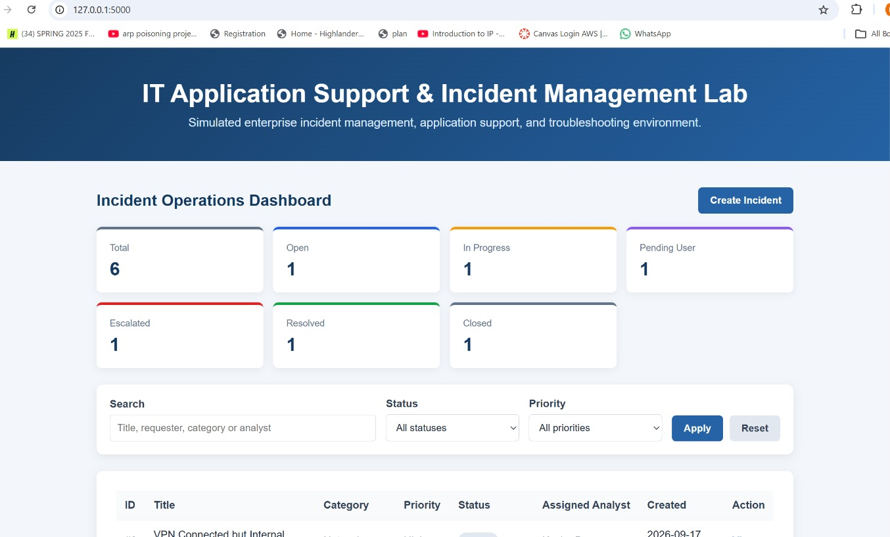
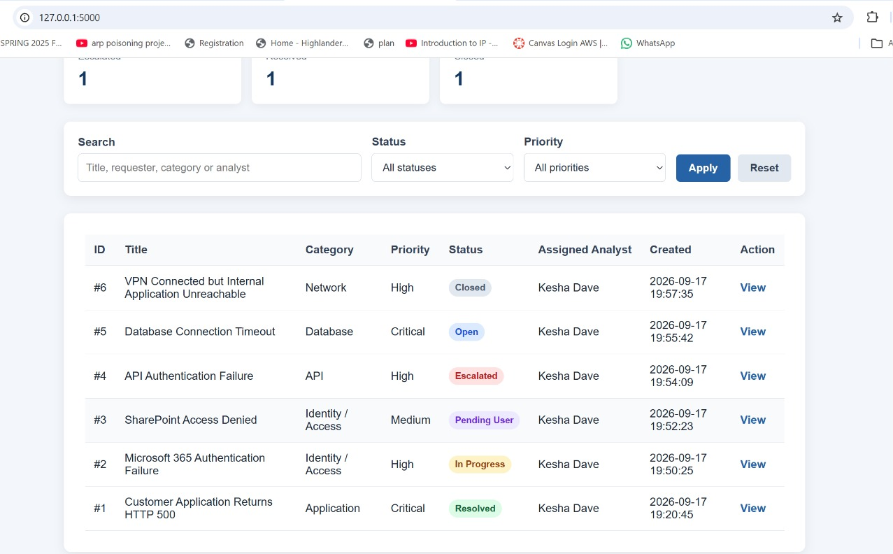
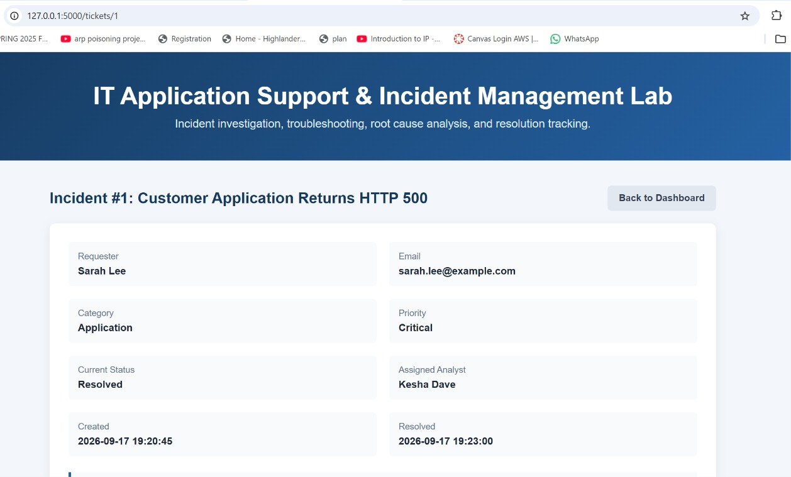
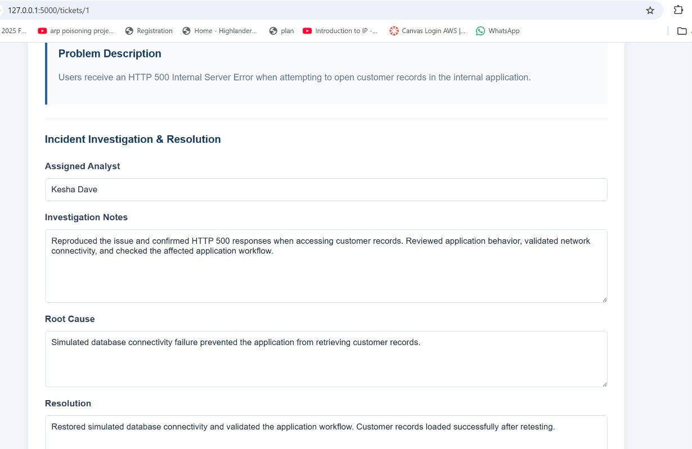
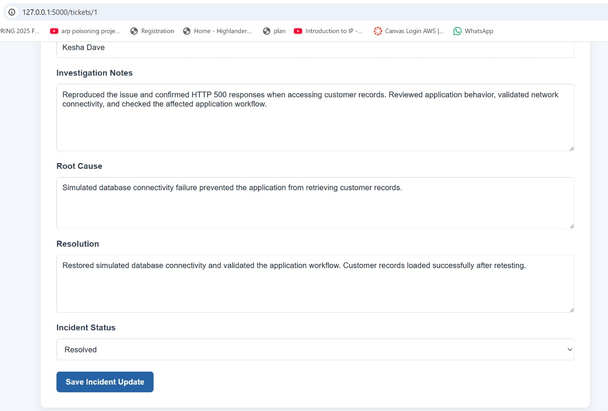
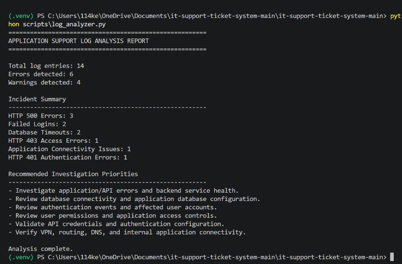
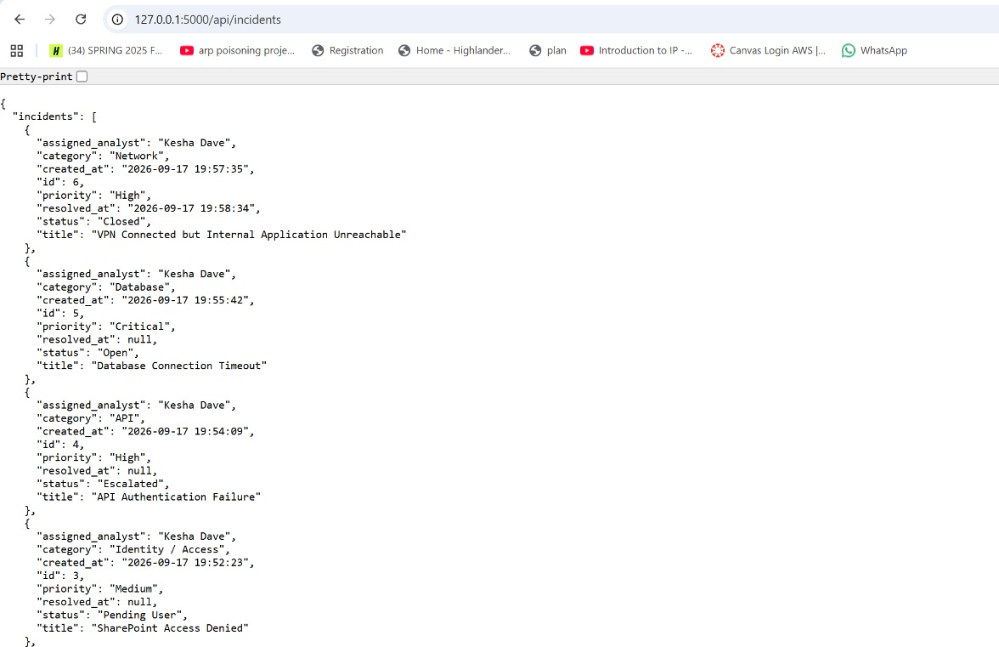
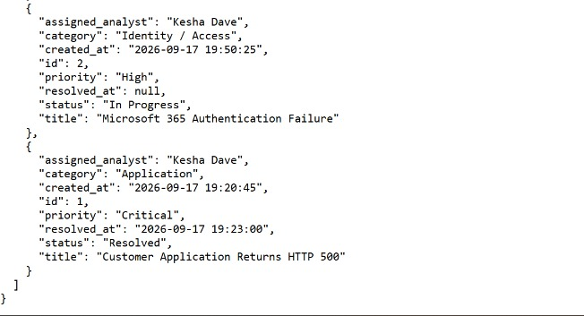

# IT Application Support & Incident Management Lab

A web-based application for recording, tracking and managing IT support requests. The project was developed as an individual portfolio project to demonstrate practical Python, Flask, SQLite, HTML, CSS, testing and Git skills.

## Project Screenshots

### Incident Operations Dashboard


### Incident Dashboard & Workflow


### Incident Summary


### Incident Investigation


### Root Cause & Resolution


### Application Log Analysis


### REST API - Incident Data


### REST API - Additional Incident Records


## Overview

The IT Application Support & Incident Management Lab provides a central interface for submitting and monitoring technical support requests. Users can record IT problems, assign priorities and view their tickets, while support personnel can review requests and update their progress.

## Features

* Create IT support tickets
* Record requester and problem information
* Categorise hardware, software, network and account-access issues
* Assign Low, Medium, High or Critical priority
* View all tickets on a central dashboard
* Open individual ticket-detail pages
* Update tickets through Open, In Progress, Resolved and Closed statuses
* Search by title, requester or category
* Filter tickets by priority and status
* View dashboard statistics for each ticket status
* Validate required form information
* Store ticket information in an SQLite database
* Run automated tests against a temporary test database
* Responsive interface for desktop and smaller screens

## Technologies Used

* Python
* Flask
* SQLite
* HTML5
* CSS3
* Jinja templates
* Python `unittest`
* Git and GitHub
* Visual Studio Code

## Project Structure

* `app.py` — Flask application, routes and database operations
* `schema.sql` — SQLite ticket-table definition
* `init_db.py` — database initialisation script
* `requirements.txt` — required Python packages
* `templates/` — HTML page templates
* `static/style.css` — application styling
* `tests/test_app.py` — automated application tests
* `screenshots/` — project interface images

## Installation

### 1. Clone the repository

```powershell
git clone https://github.com/trevolan/it-support-ticket-system.git
cd it-support-ticket-system
```

### 2. Create a virtual environment

```powershell
py -3 -m venv .venv
```

### 3. Activate the virtual environment

```powershell
.\.venv\Scripts\Activate.ps1
```

### 4. Install the required packages

```powershell
python -m pip install -r requirements.txt
```

### 5. Create the database

```powershell
python init_db.py
```

### 6. Run the application

```powershell
python -m flask --app app run --debug
```

Open the following address:

```text
http://127.0.0.1:5000
```

## Running the Tests

Run the automated test suite with:

```powershell
python -m unittest discover -s tests -v
```

The tests verify that:

* The dashboard loads successfully
* A support ticket can be created
* A ticket’s status can be updated

Tests use a temporary database and do not change the normal local ticket database.

## Database and Privacy

The local `tickets.db` file is excluded from Git tracking. This prevents locally entered ticket records from being published to GitHub. Anyone cloning the project can create a new empty database by running `python init_db.py`.

## Security and Current Scope

This project is a portfolio and learning application intended for local development. It uses parameterised SQL queries to reduce SQL-injection risk and server-side validation for ticket information.

A production version would additionally require:

* User authentication and role-based access
* CSRF protection
* Stronger email and input validation
* Production database hosting
* Secure configuration through environment variables
* HTTPS and a production WSGI server
* Logging, backups and monitoring

## 👩‍💻 Maintainer & Project Customization

**Kesha Dave**

M.S. Cybersecurity & Privacy — New Jersey Institute of Technology

This portfolio version was customized and extended by Kesha Dave to demonstrate practical skills in application support, incident management, troubleshooting, SQL analysis, REST APIs, and log analysis.

**GitHub:** https://github.com/kesha1104  
**LinkedIn:** https://linkedin.com/in/keshadave
